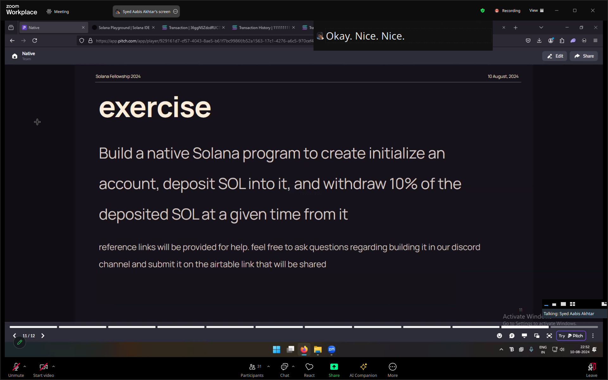

# Solana Native Developpement

## Deployed program

**Program Id:** `EZau1t4dYPQbndegQx5XynT6oADjVSMShuK5UePeWyP1`

**Program on devnet : [Solana Explorer Link](https://explorer.solana.com/address/EZau1t4dYPQbndegQx5XynT6oADjVSMShuK5UePeWyP1?cluster=devnet)**

**Transaction on devnet : [Solana Explorer Link](https://explorer.solana.com/tx/2GsUypUHENVgxJBUMqggqFDFzzPXcEgGAERUNiLu2tx5Tt7UVc7e612EABsEX2UrqqopYens2r7pDdsTm74zzn2?cluster=devnet)**


--------


## Overview



**Exercise:** Build a **native Solana program** to create/initialize an account, deposit SOL into it, and withdraw 10% of the deposited SOL at a given time from it.

Topics in this exercice :
- Rust
- PDA
- CPI
- SOL transfer
- Build native solana program & deploy on devnet

## Native Solana Project


```bash
cargo new my-solana-program --lib
cd my-solana-program
```

### **Add Solana dependancies**
In `Cargo.toml` file, add needed solana dependancies :

Replace `1.18.17` by the last stable needed version.

```toml
[dependencies]
solana-program = "1.18.17"
borsh = "1.5.1"            # Borsh for serialisation/deserialisation
borsh-derive = "1.5.1"     # using `derive` macro
```

And libs, if you want to generate `.so`...

```toml
[lib]
crate-type = ["cdylib", "lib"]
```


### **Compile the program**
Compile your program to generate a Solana-compatible binary.

```bash
cargo build-bpf
```

This will generate a `.so` file in the `target/deploy/` directory that is the program binary.

### **Deploy the program**
Deploy the compiled program to a Solana network (like devnet):

```bash
solana program deploy target/deploy/program.so
```

This will return the address of your program on Solana.

### Components


```rust
```
**processor.rs**

```rust
#[derive(BorshSerialize, BorshDeserialize, Debug)]
pub enum NativeVaultInstruction {
    Initialize(),
    Deposit(u64),
    PartialWithdraw(),
}
```

```rust
pub fn process_instruction(
    program_id: &Pubkey,
    accounts  : &[AccountInfo],
    input     : &[u8],
) -> ProgramResult {
    let instruction: NativeVaultInstruction = NativeVaultInstruction::try_from_slice(input)?;

    match instruction {

        NativeVaultInstruction::Initialize() => initialize(
            program_id,
            accounts,
        ),

        NativeVaultInstruction::Deposit(args) => deposit(
            program_id,
            accounts,
            args
        ),

        NativeVaultInstruction::PartialWithdraw() => partial_withdraw(
            program_id,
            accounts,
        ),

    }

}
```
**instructions.rs**

#### Creating account

See initialize() funcion for more comments

```rust
// Creating account
let rent: Rent = Rent::get()?;

let required_lamports: u64 = rent.minimum_balance(
    std::mem::size_of::<Vault>()
);

let ix: solana_program::instruction::Instruction = system_instruction::create_account(
    &user.key,
    &vault.key,
    required_lamports,
    std::mem::size_of::<Vault>() as u64,
    program_id,
);

// `ix` contains the account creation instruction ready to be executed.

// Sends the account creation instruction to the Solana blockchain for execution.
invoke(
    &ix,
    &[
        user.clone          (),
        vault.clone         (),
        system_program.clone(),
    ]
)?;

```
> If the instruction is successfully executed,
> the vault account will be created on the Solana blockchain,
> and the balance required for the rent will be transferred
> from the user account to the vault account.

#### Data access (serialization/usage/deserialization)

```rust
// Access (deserialization) to the data inside the `vault` account
let mut vault_data: Vault = Vault::try_from_slice(&vault.data.borrow())?;
```

```rust
vault_data.owner = *user.key;
```

```rust
// Serializes the updated Vault structure and writes that data to
// the vault account, storing the new values ​​in the blockchain.
vault_data.serialize(&mut &mut vault.data.borrow_mut()[..])?;
```
#### PDA creation

**Derive the PDA using the user's public key**

```rust
let (computed_pda, bump_seed) = Pubkey::find_program_address(
    &[
        TAG_SSF_PDA    ,     // A constant seed used to differentiate this PDA.
        user.key.as_ref(),   // The public key of the user.
    ],
    program_id  // The program ID for which the address is derived.
);
```

**Verify that the derived PDA matches the provided PDA.**

```rust
if user_pda.key != &computed_pda {
    return Err(ProgramError::InvalidAccountData);
}
```

**If the PDA account is empty (new), it needs to be initialized.**

```rust
if user_pda.data_is_empty() {
    // Gets the rent exemption amount required to keep the account alive.
    let rent: Rent = Rent::get()?;
    let required_lamports: u64 = rent.minimum_balance(std::mem::size_of::<Pda>());

    // Creates an instruction to create a new account for the PDA.
    let ix: solana_program::instruction::Instruction = system_instruction::create_account(
        &user.key               ,            // The user paying for the creation of the account.
        &computed_pda           ,            // The PDA to be created.
        required_lamports       ,            // The lamports needed for rent exemption.
        std::mem::size_of::<Pda>() as u64,   // Size of the account in bytes.
        program_id              ,            // The program ID for which the account is being created.
    );

    // Invokes the instruction to create the PDA account.
    invoke(
        &ix,
        &[
            user.clone          (),   // User's account
            user_pda.clone      (),   // PDA account
            system_program.clone(),   // System program account
        ],
    )?;

    // Initialize the PDA's data with default values.
    let mut vault_data: Pda = Pda {
        signer      : *user.key,   // Sets the user as the owner of the PDA.
        balance     : 0,           // Initial balance of the PDA.
        deposit_time: 0,           // Initial deposit timestamp set to 0.
        done        : false,       // Indicates if the PDA is finalized (closed).
    };

    vault_data.serialize(&mut &mut user_pda.data.borrow_mut()[..])?;

}
```

#### Get timestamp

```rust
// Expressed as Unix time (i.e. seconds since the Unix epoch).
let clock: Clock        = Clock::get()?;
vault_data.deposit_time = clock.unix_timestamp as i64;
```

#### SOL transfer

```rust
// Expressed as Unix time (i.e. seconds since the Unix epoch).
let clock: Clock        = Clock::get()?;
vault_data.deposit_time = clock.unix_timestamp as i64;
```


## Tree repository

```bash
.
├── client
│   ├── README.md
│   ├── bun.lockb
│   ├── index.ts
│   ├── package.json
│   └── tsconfig.json
├── src
│   ├── instructions.rs
│   ├── lib.rs
│   └── processor.rs
├── .gitignore
├── 2024-08-11-14-07-55.png
├── Cargo.lock
├── Cargo.toml
└── README.md
```


## Resources

- [How to write a Native Rust Program | Solana](https://solana.com/developers/guides/getstarted/intro-to-native-rust)
- [Native](https://pitch.com/v/native-c7gvwj)
- [Solana Playground | Solana IDE](https://beta.solpg.io/66b7a81ccffcf4b13384d2be)
- [program-examples/basics/program-derived-addresses/native/program/src/instructions/create.rs at main · solana-developers/program-examples · GitHub](https://github.com/solana-developers/program-examples/blob/main/basics/program-derived-addresses/native/program/src/instructions/create.rs)
- [rust - How to get the current time in Solana program without using any external SystemProgram account - Stack Overflow](https://stackoverflow.com/questions/72223450/how-to-get-the-current-time-in-solana-program-without-using-any-external-systemp)
- [Clock in anchor_lang::prelude - Rust](https://docs.rs/anchor-lang/latest/anchor_lang/prelude/struct.Clock.html)
- [Solana Bytes - Processing Instructions (Native) - YouTube](https://www.youtube.com/watch?v=T5p8rGD0-vs)
- [Solana Account Data Comparison -- Native vs. Anchor - YouTube](https://www.youtube.com/watch?v=71pkNLasq6c)
- [Working with Accounts in Rust Native Solana Programs [Solana Dev Course: M3 P3] - Dec 2nd '22 - YouTube](https://www.youtube.com/watch?v=Dg9p_JaqQQE)
- [rust - Unable to generate .so file for solana deployment. (No errors) - Stack Overflow](https://stackoverflow.com/questions/71287531/unable-to-generate-so-file-for-solana-deployment-no-errors)
- [Space Reference - The Anchor Book v0.29.0](https://book.anchor-lang.com/anchor_references/space.html)


